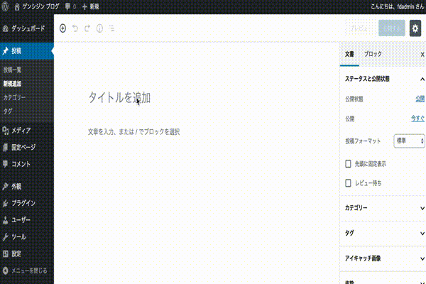

## wp-genshijin

Genshijin WordPress Plugin.

Genshijin is port of [Qiita's entry](https://qiita.com/Harusugi/items/f499e8707b36d0f570c4).

Original author is [@Harusugi](https://github.com/korinzuz2).



## Usage

### Settings

Install [WordPress](https://wordpress.org/download/).

Get `client_id` and `client_secret` from [COTOHA API Portal](https://api.ce-cotoha.com/contents/index.html).

Add `$client_secret` and `$client_secret` into `wp-genshijin.php`.

```php:wp-genshijin.php
    $client_id = '我……アイディ……入レル';
    $client_secret = 'シークレット……入レル……！';
```

### New Post

Login to WordPress Dashboard.

Enable me.

Select `New Post`.

Input your title and content.

Publish the content, and go to the article page.

## Respect Genshijins

* [heavenshell/vim-genshijin](https://github.com/heavenshell/vim-genshijin)
* [mattn/genshijin](https://github.com/mattn/genshijin)


